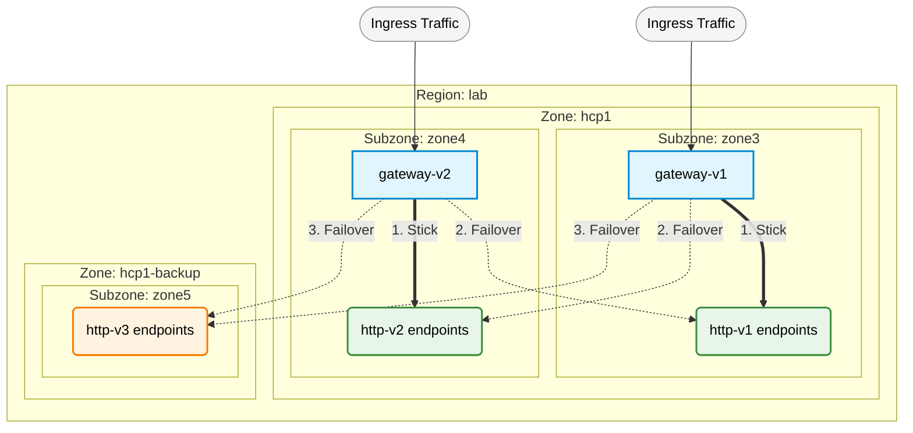
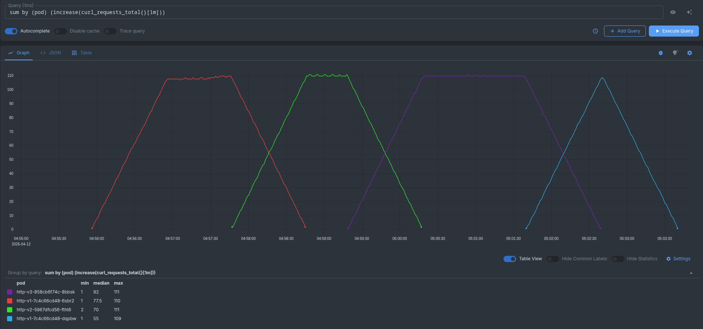

# Zone Aware Routing

This use case demonstrates three different ways to get best possible routing decision when considering multi-cluster and or firesection zones.

## Labeling your Cluster nodes for locality based loadbalancing

**NOTE kuberentes topology labels will have an impact of your workloads when being deployed and shall only be set in alignment with the infrastructure Team and any external infrastructure provider like VSphere to comply with topology configurations through all management tools.**

Following labels can be applied to make your workload and your ServiceMesh loadbalancing locality aware:

* topology.kubernetes.io/region
* topology.kubernetes.io/zone
* topology.istio.io/subzone

## Gateway alignment

Envoys [documentation](https://www.envoyproxy.io/docs/envoy/latest/intro/arch_overview/upstream/load_balancing/locality_weight.html) outlines, locality based loadbalancing will try to deiliver within it's own zone until there are no healthy endpoints available. In scenarios were your Gateway forwards the traffic to region/zone/subzone2 instead of region/zone/subzone1 means that your Gateway is not part of the region/zone/subzone1 eventhough all endpoints are up and healthy.

Adjust your Gateway injection template accordingly to your needs and preferred region/zone/subzone setup.


## Deployment

The deployment simulates multi-cluster and multi-region by manually `overwriting` the topology on the deployment level. **NOTE** this is unsupported by Red Hat and only used to serve the demonstration purpose with a single cluster.

### Certificate and Domains

The demo uses Cert-Manager as certificate provider (cert.yml). Ensure to provide a valid TLS certificate for the domain(s) you want to serve on the application accordingly.
The demo uses `apps.example.com` as base domain to service application traffic. Ensure to adjust the domain according to you infrastructure.

* update `cert.yml` accordingly to create or provide a valid ingress TLS certificate
* update following files to reflect the proper base domain and fqdn for your ingress
    * cert.yml
    * gateway-v1-cfg.yml
    * gateway-v2-cfg.yml
    * monitor.sh
    * route-zone1.yml
    * route-zone2.yml
    * vs.yml
* update the namespace `istio.io/rev` label accordingly to match your ServiceMesh `discoverySelector` 
* update the following CRs as the demo considers ZeroTrustWorkload IdentityManager already being deployed.
    * gateway-v1.yml, remove `spireGateway` from injection, remove label `spiffe.io/spire-managed-identity` 
    * gateway-v2.yml, remove `spireGateway` from injection, remove label `spiffe.io/spire-managed-identity` 
    * http-v1.yml, remove annotation `inject.istio.io/templates`, remove label `spiffe.io/spire-managed-identity`
    * http-v2.yml, remove annotation `inject.istio.io/templates`, remove label `spiffe.io/spire-managed-identity`
    * http-v3.yml, remove annotation `inject.istio.io/templates`, remove label `spiffe.io/spire-managed-identity`
* execute following command to deploy
    * 2 Gateways 
        * 2 Services type LoadBalancer
        * 2 Routes to get traffic into your cluster in case no LoadBalancer is available
    * 3 HTTPBin deployments
        * each serving it's own subzone
        * http-v1 and http-v2 serving and sharing in region lab
            * serving in their individual zone zone3 and zone4
        * http-v3 serving as separate cluster hcp1-backup and zone zone5

``` 
oc create -k zoneaware
```

#### Routing Legend:
* Solid, Thick Arrows (==>): Represent the primary "stick" priority. Traffic is pinned to endpoints matching the originating gateway's specific Subzone.
* Dotted Arrows (-.->): Represent the failover progression triggered only when the higher-priority endpoints become unavailable.
* Topology Hierarchy: The nested boxes visualize the locality structure (lab -> hcp1 or hcp1-backup -> specific zone) that Istio uses to calculate endpoint proximity for these failover rules.



## Verification and configuration for the setup

* execute a curl against the exposed service like 
```
$ for x in $(seq 1 5) ; do curl https://http.apps.example.com -s | jq -r .env.HOSTNAME ; done 
http-v1-86875bfd55-rdgpj
http-v2-6b8c89598c-w8nqq
http-v1-86875bfd55-rdgpj
http-v3-67747c7dd-rxgm5
http-v3-67747c7dd-rxgm5
```

* We can see Envoy using `LEAST_REQUEST` loadbalancing mechanism which shuffles the requests between all endpoints. 
  since `http-v3` is in a different cluster it's expected that the latency is higher than on the other requests.
* We do not want to jump the region and zone for the service so let's enforce sticking with one locality when hitting the ingress.
* Update the `destinationRule` to enable localityBased LoadBalancing

```
oc -n hcp1-ns1 patch destinationRule/http --type=merge -p '{"spec":{"trafficPolicy":{"loadBalancer":{"localityLbSetting":{"enabled":true}}}}}' 
```

* repeat the curl against the exposed service 

```
for x in $(seq 1 5) ; do curl https://http.apps.example.com -s | jq -r .env.HOSTNAME ; done

http-v1-86875bfd55-rdgpj
http-v1-86875bfd55-rdgpj
http-v1-86875bfd55-rdgpj
http-v1-86875bfd55-rdgpj
http-v1-86875bfd55-rdgpj
```

* hit the second Ingress Gateway to ensure, stickiness to the locality applies there too

```
for x in $(seq 1 5) ; do curl https://http.apps.example.com -sH 'zone: zone2' | jq -r .env.HOSTNAME ; done

http-v2-6b8c89598c-w8nqq
http-v2-6b8c89598c-w8nqq
http-v2-6b8c89598c-w8nqq
http-v2-6b8c89598c-w8nqq
http-v2-6b8c89598c-w8nqq
```

### verify locality based failover to region lab zone hcp1 subzone 4

* simulate an outage of the primary subzone (http-v1) by shutting down the service, execute the following

```
oc -n hcp1-ns1 scale --replicas=0 deploy/http-v1
```

* repeat the curl against the exposed service, **NOTE** Ingress is still available in that zone.

```
for x in $(seq 1 5) ; do curl https://http.apps.example.com -s | jq -r .env.HOSTNAME ; done

http-v2-6b8c89598c-w8nqq
http-v2-6b8c89598c-w8nqq
http-v2-6b8c89598c-w8nqq
http-v2-6b8c89598c-w8nqq
http-v2-6b8c89598c-w8nqq
```

* the Gateway automatically switch to the second zone

### verify locality based failover to a different zone hcp1-backup subzone 5

* keep the outage of the primary subzone (http-v1)
* simulate an outage of the secondary subzone (http-v2) by shutting down the service, execute the following

```
oc -n hcp1-ns1 scale --replicas=0 deploy/http-v2
```

* repeat the curl against the exposed service, **NOTE** Ingress is still available in that zone.

```
for x in $(seq 1 5) ; do curl https://http.apps.example.com -s | jq -r .env.HOSTNAME ; done

http-v3-67747c7dd-rxgm5
http-v3-67747c7dd-rxgm5
http-v3-67747c7dd-rxgm5
http-v3-67747c7dd-rxgm5
http-v3-67747c7dd-rxgm5
```

* verify that Gateway-v2 in the secondary subzone sticks to the routing as well

```
for x in $(seq 1 5) ; do curl https://http.apps.example.com -sH 'zone: zone2' | jq -r .env.HOSTNAME ; done

http-v3-67747c7dd-rxgm5
http-v3-67747c7dd-rxgm5
http-v3-67747c7dd-rxgm5
http-v3-67747c7dd-rxgm5
http-v3-67747c7dd-rxgm5
```

#### monitoring check

I've included a quick monitoring script to record the response hostname from the requests. The script expects an OpenTelemetryCollector receiving `otlp_http` on port `14318`. You can forward it to your preferred monitoring Stack to check on `sum by (pod) (increase(curl_requests_total{}[1m]))` 



# Conclusion: Zone Aware Routing Showcase

In this demonstration, we showcased how to configure and validate locality-based load balancing in a ServiceMesh to ensure the most efficient routing decisions across multi-cluster and multi-zone environments.

Here is a summary of what was accomplished:

* Topology Simulation: We simulated a multi-region and multi-cluster environment by applying specific Kubernetes topology labels for region, zone, and subzone directly at the deployment level.

* Baseline Routing Observation: We observed the default LEAST_REQUEST Envoy behavior, which shuffles traffic across all available endpoints indiscriminately, including higher-latency endpoints located in completely different clusters.

* Enabling Locality Stickiness: By patching the DestinationRule with localityLbSetting enabled, we demonstrated how to pin ingress traffic to the closest local endpoints, ensuring a gateway prefers its own subzone first.

* Intra-Region Failover: We simulated an outage of the primary subzone by scaling the http-v1 deployment to zero replicas. We then verified that the gateway automatically and successfully failed over to the next available subzone within the same region (http-v2 in zone4).

* Cross-Zone/Cluster Failover: We simulated a broader regional failure by also scaling the secondary subzone (http-v2) to zero. We successfully validated that traffic seamlessly fell back to the backup cluster located in a completely different zone (http-v3 in hcp1-backup zone5).

Ultimately, this exercise proved how to build a highly resilient, latency-optimized routing topology using Istio's native locality awareness to handle cascading failures gracefully.
