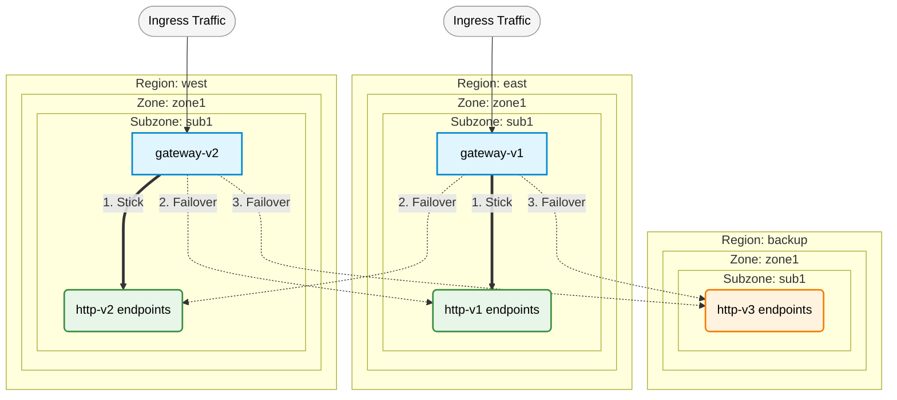
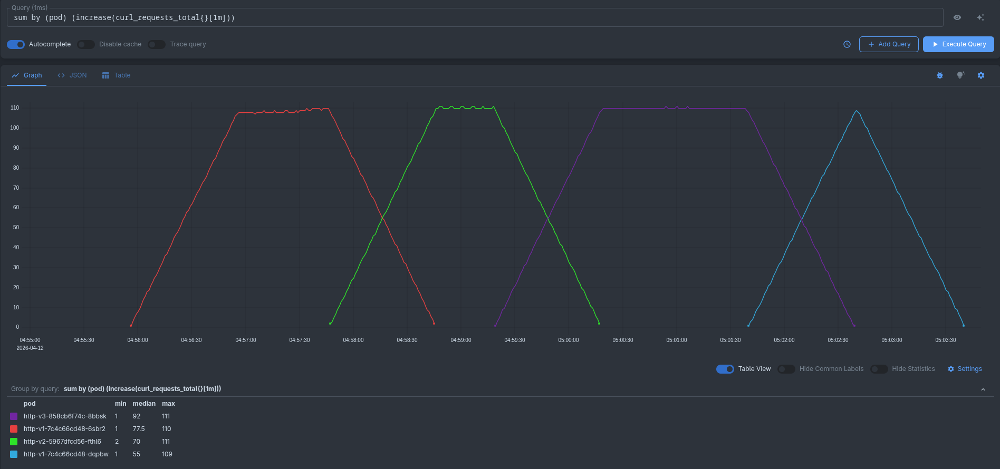

# Zone Aware Routing

This use case demonstrates three different ways to get best possible routing decision when considering multi-cluster and or firesection zones.

## Labeling your Cluster nodes for locality based loadbalancing

**NOTE kuberentes topology labels will have an impact of your workloads when being deployed and shall only be set in alignment with the infrastructure Team and any external infrastructure provider like VSphere to comply with topology configurations through all management tools.**

Following labels can be applied to make your workload and your ServiceMesh loadbalancing locality aware:

* `topology.kubernetes.io/region`
* `topology.kubernetes.io/zone`
* `topology.istio.io/subzone`

Alternatively, you can manually inject the `istio-locality` label directly into your pod templates (e.g. `istio-locality: region.zone.subzone`). This is the approach used in this demo to simulate a multi-region environment on a single cluster without modifying the node labels.

## Gateway alignment

Envoys [documentation](https://www.envoyproxy.io/docs/envoy/latest/intro/arch_overview/upstream/load_balancing/locality_weight.html) outlines, locality based loadbalancing will try to deiliver within it's own zone until there are no healthy endpoints available. In scenarios were your Gateway forwards the traffic to region/zone/subzone2 instead of region/zone/subzone1 means that your Gateway is not part of the region/zone/subzone1 eventhough all endpoints are up and healthy.

Adjust your Gateway injection template accordingly to your needs and preferred region/zone/subzone setup.


## Cluster Setup (KinD & MetalLB)

This demo is designed to run locally using [KinD (Kubernetes in Docker)](https://kind.sigs.k8s.io/). To support `LoadBalancer` services locally, we use MetalLB.

1. **Create the KinD Cluster:**
   Use the provided `setup-kind.sh` script to create the cluster with the custom `kind-config.yaml`:
   ```bash
   ./setup-kind.sh
   ```

2. **Configure MetalLB:**
   The `setup-kind.sh` script automatically installs MetalLB. It also applies the `metallb-config.yaml` to provide a pool of IP addresses for your `LoadBalancer` services. Ensure the IP range in `metallb-config.yaml` matches your Docker network subnet.

## Deployment

The deployment simulates multi-cluster and multi-region by manually `overwriting` the topology on the deployment level using the `istio-locality` label (e.g., `istio-locality: east.zone1.sub1`). **NOTE** this is unsupported by Red Hat and only used to serve the demonstration purpose with a single cluster.

### Certificate and Domains

The demo uses Cert-Manager as certificate provider (cert.yml). Ensure to provide a valid TLS certificate for the domain(s) you want to serve on the application accordingly.
The demo uses `apps.example.com` as base domain to service application traffic. Ensure to adjust the domain according to you infrastructure.

* update `cert.yml` accordingly to create or provide a valid ingress TLS certificate
* update following files to reflect the proper base domain and fqdn for your ingress
    * cert.yml
    * gateway-v1-cfg.yml
    * gateway-v2-cfg.yml
    * vs.yml
* update the namespace `istio.io/rev` label accordingly to match your ServiceMesh `discoverySelector` 
* execute following command to deploy the application stack:
    * 3 Namespaces (`frontends`, `backends`, `gateways`) with corresponding ServiceAccounts
    * Cert-Manager Issuers and Certificates for TLS
    * 2 Istio Ingress Gateways (`gateway-v1`, `gateway-v2`) with `LoadBalancer` services
    * 3 Frontend HTTPBin deployments (`http-v1`, `http-v2`, `http-v3`) serving different regions
    * 3 Backend HTTPBin deployments (`backend-v1`, `backend-v2`, `backend-v3`) serving different regions
    * Istio VirtualServices and DestinationRules for routing
    * OpenTelemetry Collector and VictoriaMetrics for observability

```bash 
oc create -k zoneaware/application
```

#### Routing Legend:
* Solid, Thick Arrows (==>): Represent the primary "stick" priority. Traffic is pinned to endpoints matching the originating gateway's specific Region.
* Dotted Arrows (-.->): Represent the failover progression triggered only when the higher-priority endpoints become unavailable.
* Topology Hierarchy: The nested boxes visualize the locality structure (east -> west -> backup) that Istio uses to calculate endpoint proximity for these failover rules.


```mermaid
flowchart TD
    %% External Ingress Traffic
    InEast([Ingress Traffic]) --> GW1
    InWest([Ingress Traffic]) --> GW2

    %% Topology Boundaries
    subgraph Region_East [Region: east]
        direction TB
        subgraph Zone_East1 [Zone: zone1]
            subgraph Sub_East1 [Subzone: sub1]
                GW1[gateway-v1]
                SVC1(http-v1 endpoints)
            end
        end
    end
    
    subgraph Region_West [Region: west]
        direction TB
        subgraph Zone_West1 [Zone: zone1]
            subgraph Sub_West1 [Subzone: sub1]
                GW2[gateway-v2]
                SVC2(http-v2 endpoints)
            end
        end
    end
    
    subgraph Region_Backup [Region: backup]
        direction TB
        subgraph Zone_Backup1 [Zone: zone1]
            subgraph Sub_Backup1 [Subzone: sub1]
                SVC3(http-v3 endpoints)
            end
        end
    end

    %% Gateway 1 Routing Logic (East)
    GW1 ==>|1. Stick| SVC1
    GW1 -.->|2. Failover| SVC2
    GW1 -.->|3. Failover| SVC3

    %% Gateway 2 Routing Logic (West)
    GW2 ==>|1. Stick| SVC2
    GW2 -.->|2. Failover| SVC1
    GW2 -.->|3. Failover| SVC3

    %% Styling and coloring for clarity
    classDef gateway fill:#e1f5fe,stroke:#0288d1,stroke-width:2px,color:#000
    classDef primary fill:#e8f5e9,stroke:#388e3c,stroke-width:2px,color:#000
    classDef backup fill:#fff3e0,stroke:#f57c00,stroke-width:2px,color:#000
    classDef ingress fill:#f5f5f5,stroke:#9e9e9e,stroke-width:1px,color:#000
    
    class GW1,GW2 gateway
    class SVC1,SVC2 primary
    class SVC3 backup
    class InEast,InWest ingress
```

## Verification and configuration for the setup

* execute a curl against the exposed service like 
```
$ for x in $(seq 1 5) ; do curl https://http.apps.example.com -s | jq -r .env.HOSTNAME ; done 
http-v1-86875bfd55-rdgpj
http-v2-6b8c89598c-w8nqq
http-v1-86875bfd55-rdgpj
http-v3-67747c7dd-rxgm5
http-v3-67747c7dd-rxgm5
```

* We can see Envoy using `LEAST_REQUEST` loadbalancing mechanism which shuffles the requests between all endpoints. 
  since `http-v3` is in a different cluster it's expected that the latency is higher than on the other requests.
* We do not want to jump the region and zone for the service so let's enforce sticking with one locality when hitting the ingress.
* Update the `destinationRule` to enable localityBased LoadBalancing

```
oc -n frontends patch destinationRule/http --type=merge -p '{"spec":{"trafficPolicy":{"loadBalancer":{"localityLbSetting":{"enabled":true}}}}}' 
```

* repeat the curl against the exposed service 

```
for x in $(seq 1 5) ; do curl https://http.apps.example.com -s | jq -r .env.HOSTNAME ; done

http-v1-86875bfd55-rdgpj
http-v1-86875bfd55-rdgpj
http-v1-86875bfd55-rdgpj
http-v1-86875bfd55-rdgpj
http-v1-86875bfd55-rdgpj
```

* hit the second Ingress Gateway to ensure, stickiness to the locality applies there too

```
for x in $(seq 1 5) ; do curl https://http.apps.example.com -sH 'zone: zone2' | jq -r .env.HOSTNAME ; done

http-v2-6b8c89598c-w8nqq
http-v2-6b8c89598c-w8nqq
http-v2-6b8c89598c-w8nqq
http-v2-6b8c89598c-w8nqq
http-v2-6b8c89598c-w8nqq
```

### verify locality based failover to region west

* simulate an outage of the primary region (http-v1) by shutting down the service, execute the following

```
oc -n frontends scale --replicas=0 deploy/http-v1
```

* repeat the curl against the exposed service, **NOTE** Ingress is still available in that zone.

```
for x in $(seq 1 5) ; do curl https://http.apps.example.com -s | jq -r .env.HOSTNAME ; done

http-v2-6b8c89598c-w8nqq
http-v2-6b8c89598c-w8nqq
http-v2-6b8c89598c-w8nqq
http-v2-6b8c89598c-w8nqq
http-v2-6b8c89598c-w8nqq
```

* the Gateway automatically switch to the second zone

### verify locality based failover to backup cluster

* keep the outage of the primary region (http-v1)
* simulate an outage of the secondary region (http-v2) by shutting down the service, execute the following

```
oc -n frontends scale --replicas=0 deploy/http-v2
```

* repeat the curl against the exposed service, **NOTE** Ingress is still available in that zone.

```
for x in $(seq 1 5) ; do curl https://http.apps.example.com -s | jq -r .env.HOSTNAME ; done

http-v3-67747c7dd-rxgm5
http-v3-67747c7dd-rxgm5
http-v3-67747c7dd-rxgm5
http-v3-67747c7dd-rxgm5
http-v3-67747c7dd-rxgm5
```

* verify that Gateway-v2 in the secondary subzone sticks to the routing as well

```
for x in $(seq 1 5) ; do curl https://http.apps.example.com -sH 'zone: zone2' | jq -r .env.HOSTNAME ; done

http-v3-67747c7dd-rxgm5
http-v3-67747c7dd-rxgm5
http-v3-67747c7dd-rxgm5
http-v3-67747c7dd-rxgm5
http-v3-67747c7dd-rxgm5
```

#### monitoring check

We provide a Python-based real-time UI dashboard to visualize the locality-based load balancing in action. The UI connects to the cluster and continuously polls the frontend and backend services, displaying the request distribution and latency in real-time.

Features of the UI:
* Real-time tracking of request counts per pod (Frontend and Backend).
* Live latency graphs to visualize the impact of cross-zone routing.
* Interactive controls to scale down (shutdown) or scale up specific deployments directly from the dashboard to simulate outages and trigger failovers.
* Dark/Light mode support.
* Configurable target URI.

To run the UI locally:
```bash
cd ui
pip install -r requirements.txt
python app.py
```
Then open `http://localhost:8080` in your browser.

Alternatively, you can build and deploy it to your cluster using the provided Dockerfile and Kubernetes manifests in the `ui/k8s` directory.



## backend verification

We've already verified that the http frontend behaves as configured in locality loadbalancing, now let's verify the same for the backend

* scale backup all http deployments by executing following command

```
oc -n frontends scale --replicas=1 deploy/http-v1 deploy/http-v2 deploy/http-v3
```

* execute following command to pass from `frontend` -> `backend` in locality based manner

```
while /bin/true ; do 
  curl 'https://http.apps.example.com/proxy/?proxy=http://backend:8080' -H 'zone: zone1' -s | \
  jq -r '.body|fromjson|.env|.HOSTNAME'
  sleep .5 
done
```

* ensure we get proper zone aligned responses

```
backend-v1-7dbdd76c-n58vk
backend-v1-7dbdd76c-n58vk
backend-v1-7dbdd76c-n58vk
backend-v1-7dbdd76c-n58vk
backend-v1-7dbdd76c-n58vk
```

* scale down backend-v1 by executing following command

```
oc -n backends scale --replicas=0 deploy/backend-v1
```

* the backend shall switch transparently to the next locality zone

```
backend-v1-7dbdd76c-n58vk
backend-v1-7dbdd76c-n58vk
backend-v1-7dbdd76c-n58vk
backend-v1-7dbdd76c-n58vk
backend-v2-7d56d9dbb8-jwlsv
backend-v2-7d56d9dbb8-jwlsv
backend-v2-7d56d9dbb8-jwlsv
backend-v2-7d56d9dbb8-jwlsv
```

* scale down backend-v2 by executing following command

```
oc -n backends scale --replicas=0 deploy/backend-v2
```

* the backend shall switch transparently to the next locality zone

```
backend-v2-7d56d9dbb8-jwlsv
backend-v2-7d56d9dbb8-jwlsv
backend-v2-7d56d9dbb8-jwlsv
backend-v2-7d56d9dbb8-jwlsv
backend-v3-5f9b797f7b-lvmzm
backend-v3-5f9b797f7b-lvmzm
backend-v3-5f9b797f7b-lvmzm
backend-v3-5f9b797f7b-lvmzm
```

## Conclusion: Zone Aware Routing Showcase

In this demonstration, we showcased how to configure and validate locality-based load balancing in a ServiceMesh to ensure the most efficient routing decisions across multi-cluster and multi-zone environments.

Here is a summary of what was accomplished:

* **Topology Simulation**: We simulated a multi-region and multi-cluster environment by applying the `istio-locality` label directly at the deployment level, bypassing the need to modify cluster node labels.
* **Baseline Routing Observation**: We observed the default LEAST_REQUEST Envoy behavior, which shuffles traffic across all available endpoints indiscriminately, including higher-latency endpoints located in completely different clusters.
* **Enabling Locality Stickiness**: By patching the `DestinationRule` with `localityLbSetting` enabled, we demonstrated how to pin ingress traffic to the closest local endpoints, ensuring a gateway prefers its own subzone first.
* **Intra-Region Failover**: We simulated an outage of the primary region by scaling the `http-v1` deployment to zero replicas. We then verified that the gateway automatically and successfully failed over to the next available region (`http-v2` in `west`).
* **Cross-Cluster Failover**: We simulated a broader regional failure by also scaling the secondary region (`http-v2`) to zero. We successfully validated that traffic seamlessly fell back to the backup cluster (`http-v3` in `backup`).
* **Backend Locality**: We proved that the exact same locality-based routing rules apply transparently to internal service-to-service communication (Frontend -> Backend).
* **Real-time Visualization**: We provided an interactive dashboard to visually demonstrate the failover mechanisms, request distributions, and the resulting latency impacts in real-time.

Ultimately, this exercise proved how to build a highly resilient, latency-optimized routing topology using Istio's native locality awareness to handle cascading failures gracefully.
